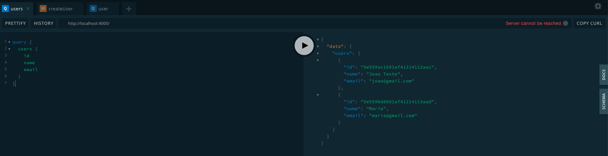
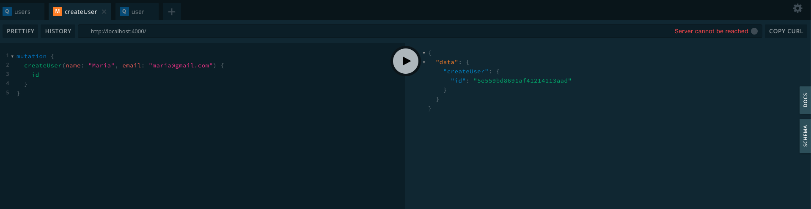
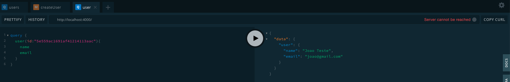

# Utilizando GraphQL no NodeJS

[GraphQL](https://graphql.org/) é uma linguagem de consulta criada pelo Facebook em 2012 e lançada publicamente em 2015. É considerada uma alternativa para arquiteturas REST, além de oferecer um serviço runtime para rodar comandos e consumir uma API.

## GraphQL Yoga

É uma ferramenta para o servidor GraphQL totalmente apresentado com foco em configuração fácil, desempenho e grande experiência do desenvolvedor.

Para demonstração do projeto basta no server.js adicionar uma conexão [MongoDB](https://www.mongodb.com/) e executar vai terminal `node src/server.js` logo após, abrir o browser de sua preferência indo até o endereço [localhost:4000](http://localhost:4000/) pra abrir o Playground do GraphQL onde poderá executar suas Querys e Mutations.

### Abaixo deixei 3 exemplos de utilização do mesmo.

#### Consultar todos os usuários.

#### Adicionar usuário retornando o id adicionado.

#### Consultar usuário por Id.

